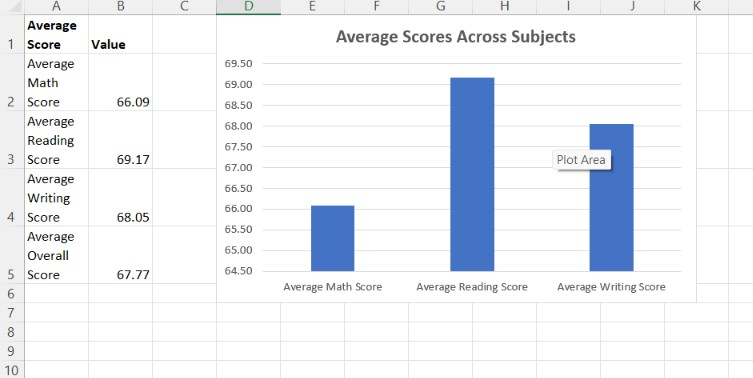
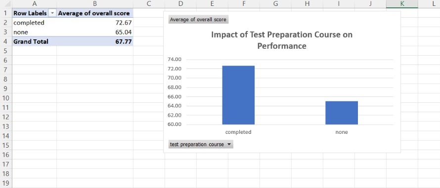
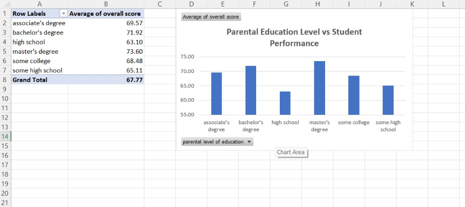

# Student Performance Analysis Using Microsoft Excel

## Overview

This project analyses student academic performance using Microsoft Excel. The objective of the analysis is to understand how demographic and educational factors influence students' performance in Mathematics, Reading, and Writing through data cleaning, formulas, Pivot Tables, and charts.

## Objectives

- Calculate an overall score for each student.
- Analyse average performance across all subjects.
- Compare academic performance based on gender.
- Evaluate the impact of test preparation courses.
- Analyse the relationship between lunch type and student performance.
- Examine how parental education level relates to academic achievement.
- Identify the highest-performing student segment.

## Dataset

The project uses the **Students Performance Dataset**, which contains information for 1,000 students, including:

- Gender
- Race/Ethnicity
- Parental Level of Education
- Lunch Type
- Test Preparation Course
- Mathematics Score
- Reading Score
- Writing Score

## Tools Used

- Microsoft Excel
- Pivot Tables
- Pivot Charts
- Excel Functions (AVERAGE)
- Basic Data Cleaning

## Analysis Performed

- Data cleaning
- Overall score calculation
- Summary statistics
- Gender-wise performance analysis
- Test preparation analysis
- Lunch type analysis
- Parental education analysis
- Identification of the highest-performing student segment

## Key Findings

- Students who completed the test preparation course achieved higher average scores.
- Students receiving a standard lunch generally performed better.
- Female students scored higher on average in Reading and Writing.
- Mathematics recorded the lowest average score among the three subjects.
- Higher parental education levels were associated with improved academic performance.

## Repository Contents

- Student_Performance_Analysis.xlsx – Excel workbook containing the complete analysis.
- StudentsPerformance.csv – Original dataset used for the project.

## Project Screenshots

### Summary Statistics

### Test Preparation Analysis

### Parental Education Analysis

## Author

Shreenithi

BBA (Strategy & Business Analytics) Student

